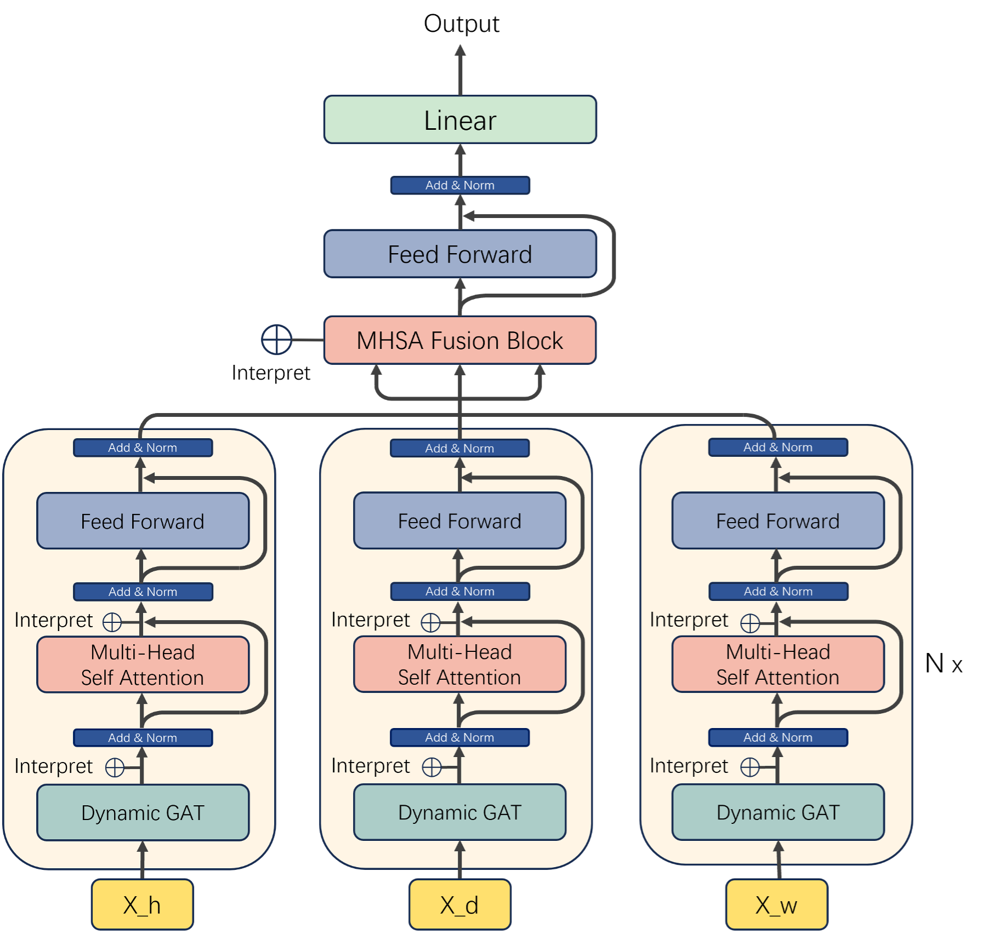

# Orion 模型 README 📖

<p align="center">
  
  
  
</p>

欢迎体验 **Orion** 模型！这是一个专为时空数据预测任务打造的深度学习框架，融合了动态图注意力网络和多周期融合机制，旨在高效处理交通流量、城市出行需求等复杂时空序列数据。本文档将为您提供详细的模型介绍、使用指南及运行步骤，助您快速上手！🚀

---

## 模型介绍 🌟

**Orion** 是一个基于 PyTorch 的时空预测模型，专为交通流量预测、城市出行需求预测等任务设计。它通过以下核心组件实现高效的时空特征提取和预测：

- **DynamicGAT**：动态图注意力网络，基于邻接矩阵筛选 K 近邻并动态调整注意力权重，捕捉空间依赖关系。
- **MultiHeadSelfAttention**：多头自注意力机制，建模时间维度上的依赖关系。
- **Belt_Block**：结合空间和时间注意力机制的核心模块，支持多周期（小时、日、周）数据处理。
- **MHSA Fusion Block**：包含注意力机制的多周期融合模块，融合不同周期（Recent、Daily、Weekly）的特征，增强模型对周期性模式的捕捉能力。

Orion 模型支持分布式训练（DistributedDataParallel, DDP），可以在多 GPU 环境下高效运行，同时提供注意力权重的可视化功能，便于模型解释和调试。

<p align="center">
  
  <br>
  <em>Orion 模型架构图（请替换为实际图片链接）</em>
</p>

### 适用场景
- 交通流量预测（如 PEMS 数据集）
- 城市出行需求预测（如 NYC Taxi、NYC Bike、Taxi BJ）
- 其他具有时空周期性特征的预测任务

---

## 数据集下载 📂

Orion 模型支持多个数据集，包括 PEMS03、PEMS04、PEMS07、PEMS08、Taxi_BJ、NYCBike2 和 NYCTaxi。数据集需放置在指定目录下：

### 数据集存放路径
**所有数据集文件（包括 Orion 和 Baseline 模型使用的任何数据）** 必须放置在项目根目录下的 `data/` 文件夹中，例如：
```
Orion/
├── data/
│   ├── PEMS03.npz
│   ├── PEMS03.csv
│   ├── PEMS04.npz
│   ├── PEMS04.csv
│   └── ...
└── ...
```
⚠️ **重要提醒**：只要项目中出现 `data/` 目录（无论在 Orion 主目录还是 Baseline 子目录下），所有相关数据集文件都必须存放在该目录中！（可能会出现文件夹不存在报错，如遇该问题请自行创建相应文件夹。）

### 数据集下载
我们通过百度网盘提供所有数据集的下载链接，请按照以下步骤操作：

- **网盘链接**：https://pan.baidu.com/s/1GLlcYoDh9Zr0bqohmO0uYg?pwd=hhs9  
- **提取码**：hhs9  
- **来源**：百度网盘超级会员v4分享

#### 下载步骤
1. 点击上述链接，输入提取码 `hhs9`。
2. 下载压缩包后，解压至 `Orion/data/` 目录。
3. 确保每个数据集包含 `.npz` 文件（流量数据）和 `.csv` 文件（邻接矩阵/边列表）。

#### 数据预处理（以 PEMS03 为例）
对于 PEMS03 数据集，需先进行节点 ID 重映射：
```bash
python data/remap_pems03_csv.py --input_csv data/PEMS03.csv --output_csv data/PEMS03_remapped.csv
python data/remap_pems03_npz.py --input_npz data/PEMS03.npz --input_csv data/PEMS03.csv --output_npz data/PEMS03_remapped.npz
```

其他数据集无需额外处理，直接使用即可。

---

## 环境配置 🛠️

### Orion 模型环境要求
Orion 模型基于 PyTorch 开发，支持单 GPU 和多 GPU 训练。以下是大环境和依赖库的配置要求：

#### 大环境
- **操作系统**：Linux（推荐 Ubuntu 20.04 或更高版本）🐧
- **Python 版本**：Python 3.8 或更高版本
- **CUDA 版本**：CUDA 11.3 或更高版本（与 PyTorch 版本匹配）
- **GPU 驱动**：NVIDIA 驱动 470 或更高版本

#### 依赖库
运行以下命令安装必要的 Python 库：
```bash
pip install torch numpy pandas matplotlib seaborn tqdm
```

#### 详细依赖说明
- `torch`：深度学习框架，推荐与 CUDA 版本匹配的版本（如 `torch==1.12.0+cu113`）。
- `numpy`：用于数据处理和矩阵运算。
- `pandas`：用于读取和处理邻接矩阵（`.csv` 文件）。
- `matplotlib` 和 `seaborn`：用于可视化注意力权重和训练损失曲线。
- `tqdm`：用于显示训练和数据处理的进度条。

### Baseline 模型环境要求
Orion 项目中包含多个 Baseline 模型（如 ASTGCN、DCRNN、Graph-WaveNet、LSTM、STGCN、STID）。这些模型的运行环境可能有所不同，请参考各自目录下的 `README` 文件。例如：
- `baseline/ASTGCN/README.md`
- `baseline/DCRNN/README.md`

通常，Baseline 模型也依赖 PyTorch，但可能需要额外的库（如 `torch-geometric` 用于图神经网络）。请根据具体模型的文档进行配置。

---

## 工程文件夹样式 📁

以下是 Orion 项目的目录结构（与图片一致）：

```
Orion/
├── baseline/                   # Baseline 模型目录
│   ├── ASTGCN/
│   ├── DCRNN/
│   ├── Graph-WaveNet/
│   ├── LSTM/
│   ├── STGCN/
│   ├── STID/
│   └── ...
├── configurations/             # 配置文件目录
│   ├── Orion/
│   │   ├── Orion_PEMS03_config.conf
│   │   ├── Orion_PEMS04_config.conf
│   │   ├── Orion_PEMS07_config.conf
│   │   ├── Orion_PEMS08_config.conf
│   │   ├── Orion_Taxi_BJ_hist12_pred12_group1_config.conf
│   │   ├── Orion_NYCBike2_part1_config.conf
│   │   ├── Orion_NYCTaxi_part1_config.conf
│   │   └── ...
│   └── ...
├── data/                       # 数据集存放目录（需手动创建并放入数据）
│   ├── PEMS03.npz
│   ├── PEMS03.csv
│   ├── PEMS03_remapped.npz
│   ├── PEMS03_remapped.csv
│   └── ...
├── results/                    # 训练结果和日志存放目录（自动生成）
│   ├── checkpoint.pth
│   ├── training_log.csv
│   ├── loss_plot.png
│   └── ...
├── 运行指令.txt                # 运行指令记录文件
├── Orion_model.py              # Orion 模型定义文件
├── prepareData.py              # 数据预处理脚本
├── test_Orion.py               # 测试脚本
├── train_Orion.py              # 训练脚本
└── train_Orion (中间每一个epoch都图例版本).py  # 带中间 epoch 可视化的训练脚本
```

---

## 参数设置 ⚙️

Orion 模型的参数主要通过配置文件（`configurations/Orion_*.conf`）进行设置。默认参数已经针对大多数数据集进行了优化，您可以直接使用。如果需要调整，建议仅修改以下关键参数：

- **batch_size**：批次大小，可根据 GPU 显存调整。
  - 默认值：配置文件中指定（通常为 64）。
  - 推荐值：对于 2080 Ti（22G 显存），建议设置为 32 或 64；对于更大显存的 GPU，可适当增加。

#### 修改 batch_size 示例
编辑配置文件（例如 `configurations/Orion_PEMS03_config.conf`）：
```ini
[Training]
batch_size = 32  ; 调整为 32
```

其他参数（如学习率、epoch 数量、Dropout 率等）建议保持默认值，除非您有特定的优化需求。

---

## 硬件环境推荐 💻

### Orion 模型
- **推荐配置**：4 张 NVIDIA 2080 Ti（22G 显存）或更高性能的 GPU。
- **原因**：Orion 模型支持分布式训练（DDP），在多 GPU 环境下可以显著加速训练过程，尤其是在处理大规模数据集（如 PEMS07、PEMS08）时。

### Baseline 模型
- **推荐配置**：单张 NVIDIA 2080 Ti（22G 显存）或更高性能的 GPU。
- **原因**：大多数 Baseline 模型（如 ASTGCN、DCRNN）不支持分布式训练，单 GPU 即可满足需求。

#### 显存需求说明
- **Orion**：一个 batch 的显存占用约为 4-6GB（batch_size=32 时）。4 张 2080 Ti 可以并行处理更大的 batch 或更复杂的数据集。
- **Baseline**：显存占用因模型而异，通常 2-4GB 即可（batch_size=32 时）。

---

## 运行指令 🖥️

以下是 Orion 模型和 Baseline 模型的运行步骤，包括数据预处理、训练和测试。

### 1. 数据预处理
运行 `prepareData.py` 预处理数据，生成训练、验证和测试数据集：
```bash
python prepareData.py --config configurations/Orion_PEMS03_config.conf
```

#### 针对不同数据集
- **PEMS03**：
  ```bash
  python prepareData.py --config configurations/Orion_PEMS03_config.conf
  ```
- **PEMS04**：
  ```bash
  python prepareData.py --config configurations/Orion_PEMS04_config.conf
  ```
- **PEMS07**：
  ```bash
  python prepareData.py --config configurations/Orion_PEMS07_config.conf
  ```
- **PEMS08**：
  ```bash
  python prepareData.py --config configurations/Orion_PEMS08_config.conf
  ```
- **Taxi_BJ_hist12_pred12_group1**：
  ```bash
  python prepareData.py --config configurations/Orion_Taxi_BJ_hist12_pred12_group1_config.conf
  ```
- **NYCBike2_part1**：
  ```bash
  python prepareData.py --config configurations/Orion_NYCBike2_part1_config.conf
  ```
- **NYCTaxi_part1**：
  ```bash
  python prepareData.py --config configurations/Orion_NYCTaxi_part1_config.conf
  ```

### 2. 训练模型

#### Orion 模型
Orion 支持单 GPU 和多 GPU 训练。

- **单 GPU 训练**：
  ```bash
  python train_Orion.py --config configurations/Orion_PEMS03_config.conf
  ```

- **多 GPU 训练**（以 4 个 GPU 为例）：
  ```bash
  torchrun --nproc-per-node=4 --master-port=12356 train_Orion.py --config configurations/Orion_PEMS03_config.conf
  ```

##### 针对不同数据集（多 GPU 训练）
- **PEMS03**：
  ```bash
  torchrun --nproc-per-node=4 --master-port=12356 train_Orion.py --config configurations/Orion_PEMS03_config.conf
  ```
- **PEMS04**：
  ```bash
  torchrun --nproc-per-node=4 --master-port=12356 train_Orion.py --config configurations/Orion_PEMS04_config.conf
  ```
- **PEMS07**：
  ```bash
  torchrun --nproc-per-node=4 --master-port=12356 train_Orion.py --config configurations/Orion_PEMS07_config.conf
  ```
- **PEMS08**：
  ```bash
  torchrun --nproc-per-node=4 --master-port=12356 train_Orion.py --config configurations/Orion_PEMS08_config.conf
  ```
- **Taxi_BJ_hist12_pred12_group1**：
  ```bash
  torchrun --nproc-per-node=4 --master-port=12356 train_Orion.py --config configurations/Orion_Taxi_BJ_hist12_pred12_group1_config.conf
  ```
- **NYCBike2_part1**：
  ```bash
  torchrun --nproc-per-node=4 --master-port=12356 train_Orion.py --config configurations/Orion_NYCBike2_part1_config.conf
  ```
- **NYCTaxi_part1**：
  ```bash
  torchrun --nproc-per-node=4 --master-port=12356 train_Orion.py --config configurations/Orion_NYCTaxi_part1_config.conf
  ```

#### Baseline 模型
Baseline 模型的运行指令请参见相应目录下的“运行指令.txt”文件 TEMPORARY，例如：
- `baseline/ASTGCN/运行指令.txt`
- `baseline/DCRNN/运行指令.txt`

### 3. 测试模型

#### Orion 模型
Orion 支持单 GPU 和多 GPU 测试。

- **单 GPU 测试**：
  ```bash
  python test_Orion.py --config configurations/Orion_PEMS03_config.conf
  ```

- **多 GPU 测试**（以 4 个 GPU 为例）：
  ```bash
  torchrun --nproc-per-node=4 --master-port=12356 test_Orion.py --config configurations/Orion_PEMS03_config.conf
  ```

##### 针对不同数据集（多 GPU 测试）
- **PEMS03**：
  ```bash
  torchrun --nproc-per-node=4 --master-port=12356 test_Orion.py --config configurations/Orion_PEMS03_config.conf
  ```
- **PEMS04**：
  ```bash
  torchrun --nproc-per-node=4 --master-port=12356 test_Orion.py --config configurations/Orion_PEMS04_config.conf
  ```
- **PEMS07**：
  ```bash
  torchrun --nproc-per-node=4 --master-port=12356 test_Orion.py --config configurations/Orion_PEMS07_config.conf
  ```
- **PEMS08**：
  ```bash
  torchrun --nproc-per-node=4 --master-port=12356 test_Orion.py --config configurations/Orion_PEMS08_config.conf
  ```
- **Taxi_BJ_hist12_pred12_group1**：
  ```bash
  torchrun --nproc-per-node=4 --master-port=12356 test_Orion.py --config configurations/Orion_Taxi_BJ_hist12_pred12_group1_config.conf
  ```
- **NYCBike2_part1**：
  ```bash
  torchrun --nproc-per-node=4 --master-port=12356 test_Orion.py --config configurations/Orion_NYCBike2_part1_config.conf
  ```
- **NYCTaxi_part1**：
  ```bash
  torchrun --nproc-per-node=4 --master-port=12356 test_Orion.py --config configurations/Orion_NYCTaxi_part1_config.conf
  ```

#### Baseline 模型
Baseline 模型的运行指令请参见相应目录下的“运行指令.txt”文件，例如：
- `baseline/ASTGCN/运行指令.txt`
- `baseline/DCRNN/运行指令.txt`

---

## 结果保存与可视化 📊

### 训练结果
训练过程中，Orion 模型会自动保存以下文件到 `results/` 目录：
- **checkpoint.pth**：训练过程中的检查点文件，包含模型参数、优化器状态等。
- **best_model.pth**：验证集上表现最佳的模型参数。
- **training_log.csv**：训练日志，记录每个 epoch 的训练损失、验证损失、MAE、RMSE、MAPE 等指标。
- **loss_plot.png**：训练和验证损失曲线图。

### 可视化
Orion 模型支持注意力权重的可视化（需在配置文件中启用）。可视化结果会保存到 `results/attention_visualization/` 目录，包括：
- **GAT 注意力权重**：空间注意力热力图。
- **Temporal 注意力权重**：时间注意力热力图。
- **Fusion 注意力权重**：周期融合注意力热力图。

---

## 致谢 🙏

感谢您使用 Orion 模型！本项目受到以下工作的启发：
- **ASTGCN**：Attention Based Spatial-Temporal Graph Convolutional Networks for Traffic Flow Forecasting.

如果您在使用过程中有任何问题或建议，欢迎通过以下方式联系我们：
- **邮箱**：example@orion-model.org
- **GitHub**：https://github.com/orion-model

祝您实验顺利，取得优异成果！🎉

---

**Orion 团队**  
**2025年4月**
